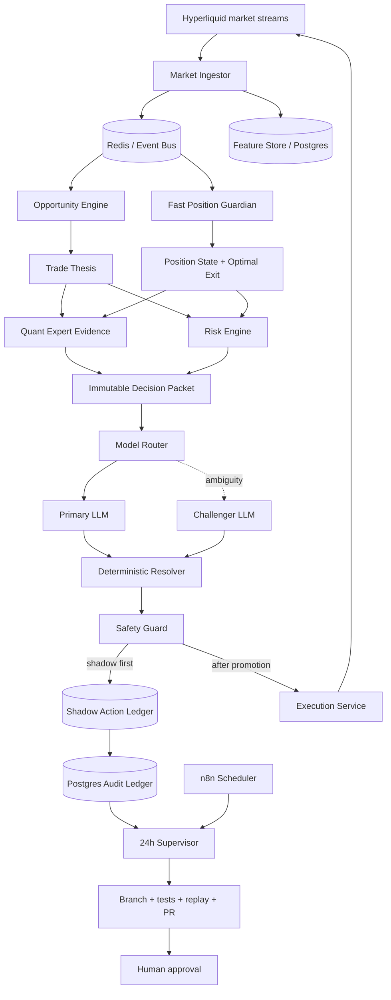

# Hyperliquid Bot V2 — target architecture

## Principle

The V2 is not an ensemble of indicators. Each service owns one falsifiable responsibility:

- **Market Ingestor:** timestamped, replayable market facts.
- **Opportunity Engine:** creates an expiring trade thesis; it never manages an open position.
- **Position Guardian:** manages the economic lifecycle of an open position; it never creates an entry.
- **Pump Momentum Engine:** estimates expansion versus exhaustion from velocity, acceleration, aggressive flow, OI and structure.
- **Quant Expert:** retrieves comparable historical cases and returns distributions, sample size, uncertainty and net expected value; never a BUY score.
- **Risk Engine:** deterministic action and capital envelope.
- **Model Router:** selects providers by task benchmark, invokes a challenger only on ambiguity/high impact and resolves disagreement conservatively.
- **Execution Service:** the only service allowed to hold the signing key.
- **Supervisor:** audits, proposes one causal change on a branch and opens a PR. It cannot merge or deploy.
- **n8n:** schedules and orchestrates slow workflows; it is never in the real-time trading path.

## Real-time lifecycle

1. Market data is normalized with exchange time and ingestion time.
2. Opportunity Engine may emit a `TradeThesis` with entry zone, invalidation, expected path and expiry.
3. Quant Expert attaches evidence from comparable *past-only* cases.
4. Risk Engine creates the maximum permitted envelope; no model can enlarge it.
5. The Model Router sends one immutable packet to the primary model.
6. A challenger is called only for low confidence, close EV ties, high exposure or data conflict.
7. Disagreement on new risk resolves to HOLD/NO_TRADE.
8. In shadow mode the action is stored but never sent to Hyperliquid.
9. When a position exists, the Position Guardian updates every few seconds and emits an LLM review only on an economic state transition.
10. Exit logic compares `EV_HOLD` with `EV_CLOSE` and a dynamic profit floor; it does not use a fixed positive-duration timer.

## Supervisor lifecycle

1. n8n triggers the read-only audit every 24 hours.
2. The Supervisor freezes an evidence cutoff and hashes the dataset.
3. Quant metrics include net expectancy, MFE/MAE, profit capture, giveback, green-to-red, costs, symbol/regime stability and model calibration.
4. Primary and critic models must formulate and challenge one falsifiable hypothesis.
5. The policy gate returns `NO_CHANGE` unless sample, out-of-sample, cross-symbol and drawdown conditions pass.
6. A passing proposal may modify one non-immutable file on an experiment branch.
7. CI runs invariants, no-lookahead tests, replay, walk-forward and cost stress.
8. The Supervisor may open a PR. Merge and production deploy always remain disabled.

## Promotion stages

- **Stage 0:** contracts and deterministic tests.
- **Stage 1:** full shadow, no private key.
- **Stage 2:** replay and walk-forward benchmark against V1.
- **Stage 3:** mainnet canary with reduced immutable risk after human approval.
- **Stage 4:** gradual promotion only if V2 improves net expectancy and profit capture without material drawdown deterioration.
